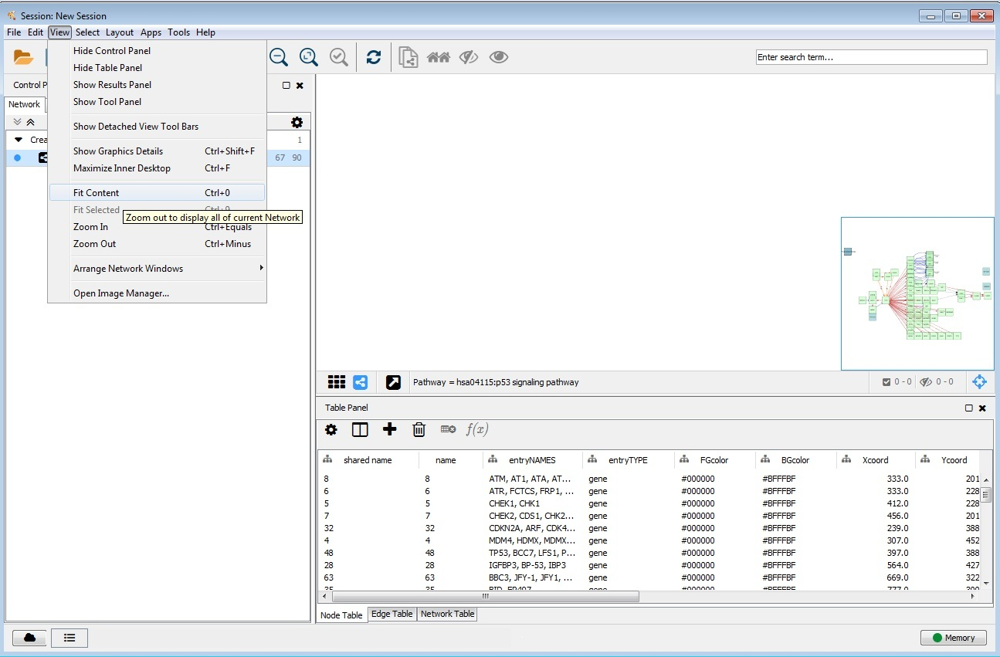
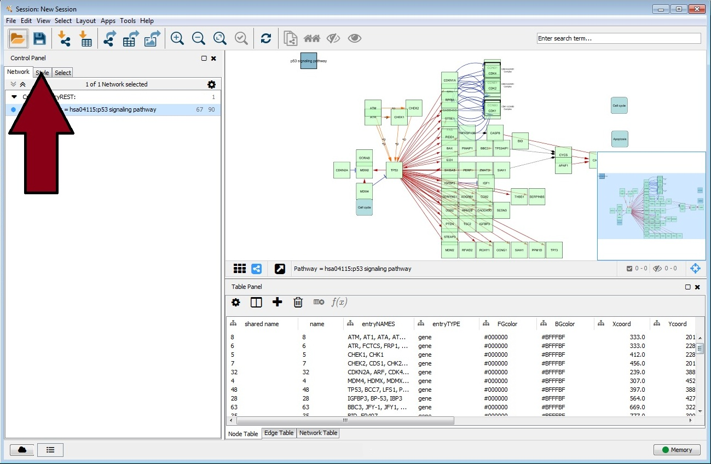
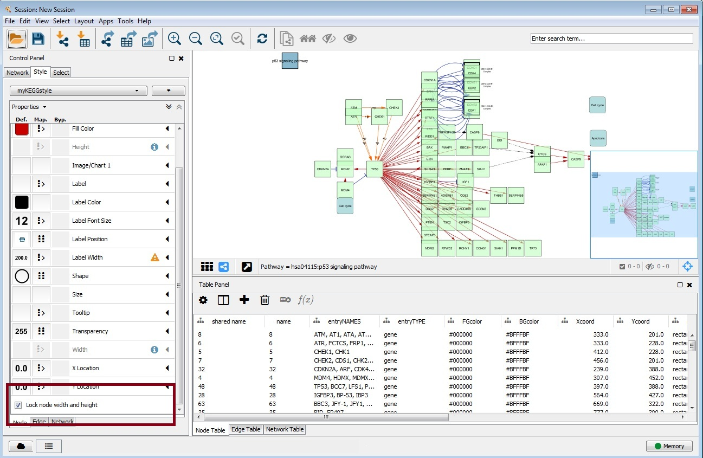

##Manually format pathway maps for convenient viewing and proper node size
The following two steps must be followed to reproduce the pathway maps as seen
in the workflows for users without RCy3 available on their system.  If RCy3 is
available, please use the functions `cyto_vis_auto` and `KEGG_lincs_auto` 
from https://github.com/uc-bd2k/KEGGlincs/blob/master/R/cyto_vis_auto.R and
https://github.com/uc-bd2k/KEGGlincs/blob/master/R/KEGG_lincs_auto.R. 

Otherwise please follow the steps outlined below.

### 1) Autofit content to window

```{r autofit,eval=TRUE,echo=FALSE,out.width=800}

```

### 2) 'Re-lock' the node width and height
Neither this package's author nor other collaborators working on similar 
projects using Cytoscape via cyREST understand why this step is neccessary.

First, locate the 'Style' tab under the Control Panel

```{r locate_style,eval=TRUE,echo=FALSE,out.width=800}

```

Then, scroll down [if needed] to the bottom of the window and locate the box
labelled "Lock node width and height".  

```{r find_box,eval=TRUE,echo=FALSE,out.width=800}

```

The box should be checked; uncheck the box, then re-check it - the nodes should
then convert to their intended width/height format.

##Modify the threshold to label edges even if desired pathway has many edges

If a pathway has a large number of edges (for example the Fox0 pathway 
showcased in Workflow 1), users can adjust Cytoscape settings to render the 
edge labels by selecting following the path Edit > Preferences > Properties and
selecting render.edgeLabelThreshold.  Click 'Modify' and increase the value as
desired [or until edge labels become visible].  The default setting in 
Cytoscape is 200.
