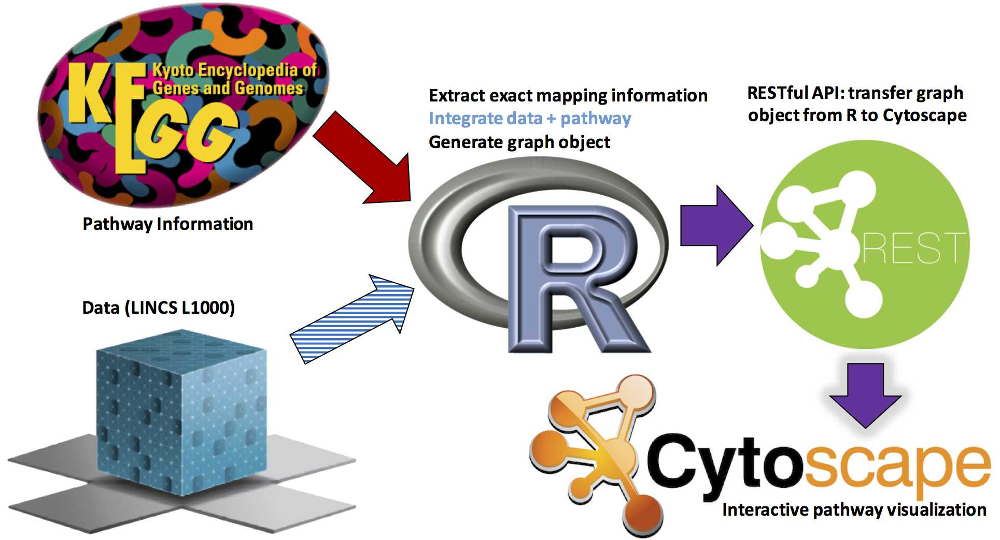
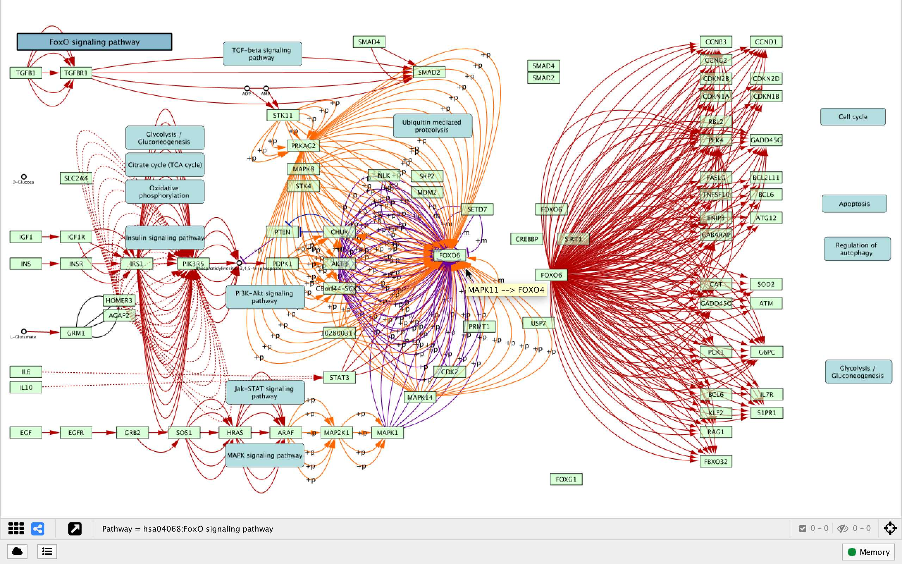
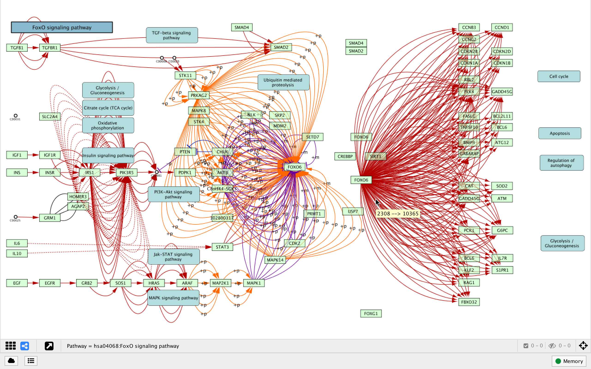
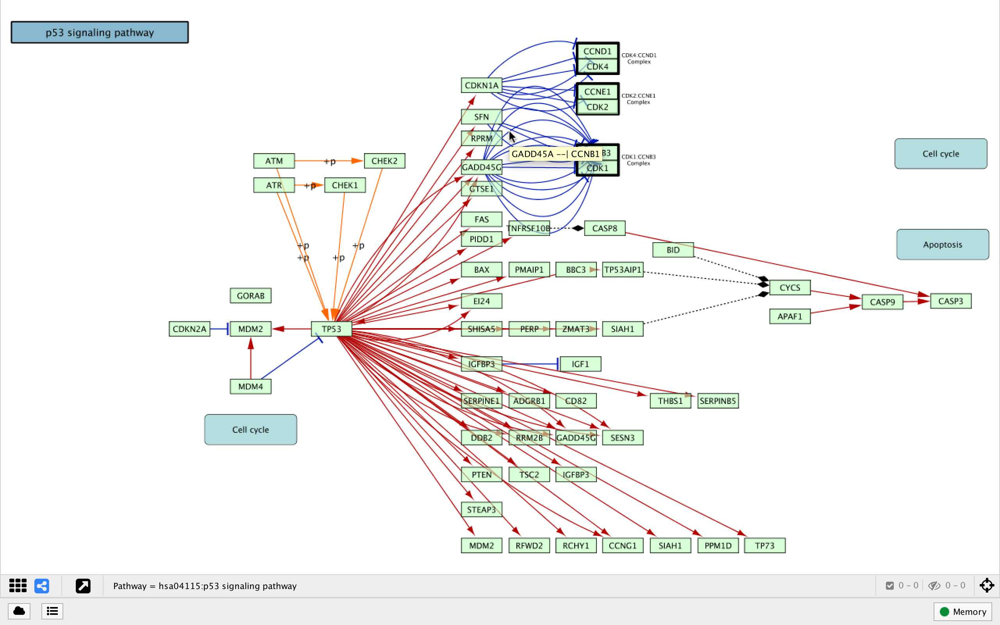
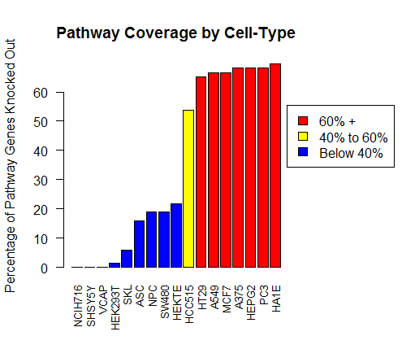
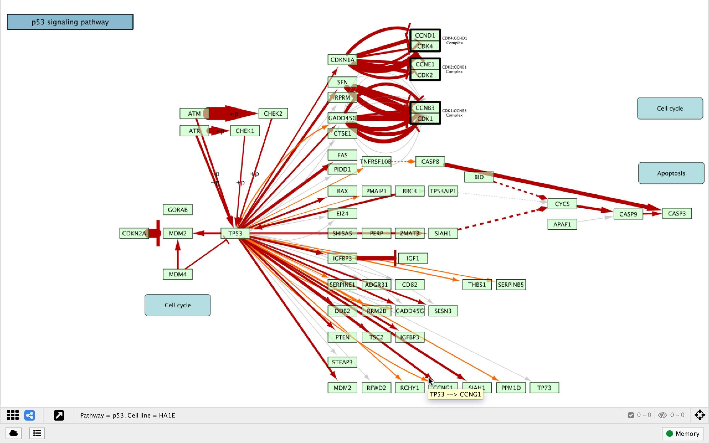
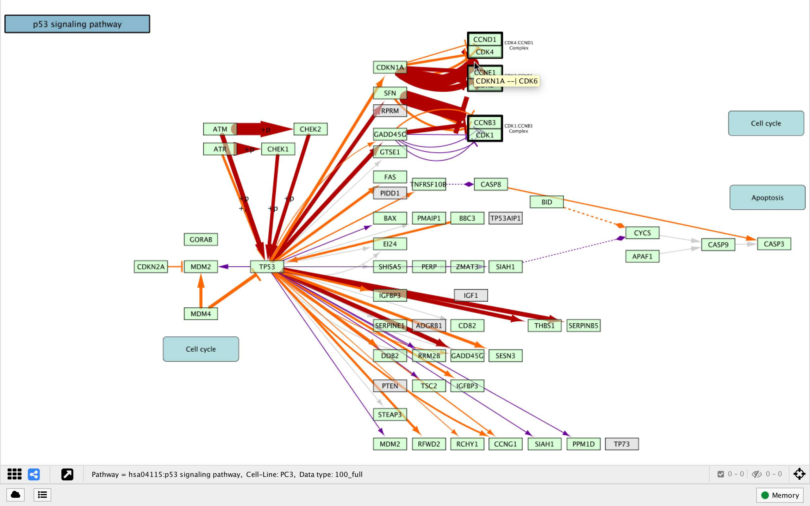
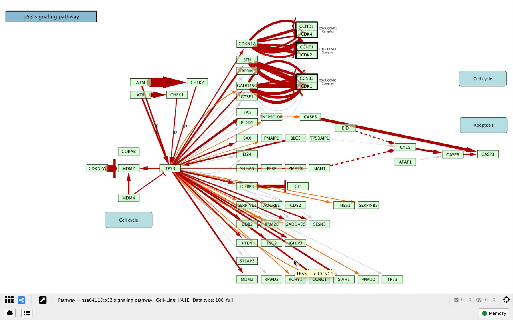

##Overview of KEGGlincs

```{r render_overview_png,eval=TRUE,echo=FALSE,out.width=800}

```

The package KEGGlincs and the functions contained within it are designed such 
that users can explore KEGG pathways in a more meaningful and informative manner
both visually and analytically.  This method of pathway analysis is approached
via functions that handle the following (related) objectives:

- 'Expanding' node mapping for [assumed to be] paralogous node entries 
and grouped node entries
- Allowing data to be explicitly mapped to 'expanded' pathway edges 
(no summarization necessary)

The idea of 'expanded' nodes and edges should become very clear after reviewing 
the following example KEGGlincs workflows.  Please keep in mind, the individual 
functions detailed in the following workflows are incorporated into the 
`KEGG_lincs` 'master function'; these workflows are designed to provide users a 
with a better understanding of how this function works, how pathway topology is
represented in KGML files, and how this package could be used with 
non-LINCS edge data (see Workflow 2).

##Workflow 1: Visualize detailed 'expanded' KEGG pathways 
###No data added to edges 

This workflow is intended to give users insight into the 'expansion' of KEGG 
pathway mapping via manipulation of the source KGML file. The only input 
required is the KEGG pathway ID for your pathway of choice. The primary goal 
for this method of pathway re-generation is to give users insight into the 
complexity that underlies many KEGG pathways but is in a sense 'hidden', yet 
hard-coded, in the curated KGML files.  Users can also see the *exact* pathway
topology that is used for input in analyses such as SPIA (Signaling Pathway 
Impact Analysis).

####Initialize KEGGlincs package (development phase)
```{r initialize, message = FALSE, warning=FALSE}
library(KEGGlincs)
```

####Download and parse the most current KGML file for Fox0 signaling pathway
```{r get_KGML, collapse=TRUE}
FoxO_KGML <- get_KGML("hsa04068")

#Information from KGML can be accessed using the following syntax:
slot(FoxO_KGML, "pathwayInfo")
```
####The code chunks below are useful for viewing the original pathway image.

```{r access_KGML, collapse=TRUE}
#Get address for pathway with active links:
slot(slot(FoxO_KGML, "pathwayInfo"), "image")
```

```{r get_png, eval = FALSE}
#Download a static pathway image (png file) to working directory:
image_link <- slot(slot(FoxO_KGML, "pathwayInfo"), "image")
download.file(image_link, basename(image_link), mode = "wb")
```

#####Rendering of the png file for the p53 signaling pathway from KEGG:
```{r render_png,eval=TRUE,echo=FALSE,out.width=800}
knitr::include_graphics("image_files/hsa04068.png")
```

#####The following commands produce 'expanded' node and edge sets
Note that KEGG IDs are converted to gene/compound symbols; this conversion 
accounts for the majority of computing time behind the `expand_KEGG_mappings` 
function. For quicker map generation, users may chose to change the argument 
`convert_KEGG_IDs` to `FALSE`; this will result in edges being identified by 
pairs of accession numbers instead of symbols in the final pathway map (example
at end of this workflow using `KEGG_lincs` master function).

```{r speed_up_for_ex, echo=FALSE}
FoxO_KEGG_mappings <- expand_KEGG_mappings(FoxO_KGML, convert_KEGG_IDs = FALSE)
```

```{r expand_mapping_for_show, eval=FALSE}
FoxO_KEGG_mappings <- expand_KEGG_mappings(FoxO_KGML)
```

```{r expand_edges}
FoxO_edges <- expand_KEGG_edges(FoxO_KGML, FoxO_KEGG_mappings)
```

#####Compare counts for 'expanded' vs. 'unexpanded' nodes and edges:
```{r compare_lengths, collapse=TRUE}
length(graph::nodes(FoxO_KGML)) # 'Un-expanded' nodes
nrow(FoxO_KEGG_mappings)        # 'Expanded' nodes

length(graph::edges(FoxO_KGML)) # 'Un-expanded' edges
nrow(FoxO_edges)                # 'Expanded' edges
```

#####Add graphing information to nodes and edges and get graph object:
Note: While the `node_mapping_info` function is rather trivial, the
`edge_mapping_info` functions differently when data is added.
```{r mapping_info, collapse=TRUE}
#Modify existing data sets; specify as nodes and edges
FoxO_node_mapping_info <- node_mapping_info(FoxO_KEGG_mappings)
FoxO_edge_mapping_info <- edge_mapping_info(FoxO_edges)

#Create an igraph object
GO <- get_graph_object(FoxO_node_mapping_info, FoxO_edge_mapping_info)
class(GO)
```

#####Finally, transform graph object and send to Cytoscape with one command:
```{r cyto_vis, collapse=TRUE, eval=FALSE}
cyto_vis(GO, "FoxO Pathway with Expanded Edges[no data added]")
```

#####Graph rendered in Cytoscape:
```{r render_graph,eval=TRUE,echo=FALSE,out.width=800}

```
Edge Color Key:

<span style="color:red">Red: Activation or Expression </span> *

<span style="color:orange">Orange: Activating PTM </span> **

<span style="color:green">
Green: PTM (no activation/inhibition activity defined) </span> 

<span style="color:blue">Blue: Inhibition </span>

<span style="color:purple">Purple: Inhibiting PTM </span>

Black(solid): Binding/Association

Black(dashed): Indirect effect (no activation/inhibition activity defined)

*Any dashed colored line indicates that the effect is indirect

**PTM = post-translational modification or, as KEGG defines them, 
'molecular events'.

+ The specific types of PTMS (indicated by edge label) include:
    - +p: phosphorylation
    - -p: dephosphorylation
    - +g: glycosylation
    - +u: ubiquitination
    - +m: methylation

Notice that the original KEGG pathway image includes visual elements such as 
cellular-component-demarcations and certain edges (especially those 'connecting'
genes to other pathways) that are not rendered in Cytoscape.  These are features
that are either not explicitly part of the pathway topology (i.e. not nodes or 
edges connecting nodes) or have not been hard-coded in the KGML file.  The node
labels may also differ between maps (KEGGlincs labels nodes as the first 'alias'
in the respective KGML slot as there is no corresponding 'label' slot).

*Note: to have the pathway maps automatically formatted for convenient viewing
and proper node size, please use the function `cyto_vis_auto`:
https://github.com/uc-bd2k/KEGGlincs/blob/master/R/cyto_vis_auto.R
This function requires systems to have the R package RCy3 installed, which is 
not yet available for all systems.

Otherwise please follow the steps under `CytoscapeSettings.Rmd` to reproduce 
the maps generated in this vignette.

#####Alternative: KEGG_lincs master function
The steps above may be avoided if the user does not wish to generate 
intermediary files/objects by making use of the function  `KEGG_lincs` as 
follows:

```{r eval = FALSE}
KEGG_lincs("hsa04068")
```

If users would like the Cytoscape-rendered map along with the detailed list of 
expanded edges (as an R object), `KEGG_lincs` can be invoked as follows:
```{r eval = FALSE}
FoxO_edges <- KEGG_lincs("hsa04068")
```

To speed up the mapping process (at the expense of having edges labelled with 
pairs of gene accession numbers as opposed to symbols) users may change the 
default `convert_KEGG_IDs` argumet to `FALSE`
```{r eval = FALSE, echo = TRUE}
KEGG_lincs("hsa04068", convert_KEGG_IDs = FALSE)
```

*Note: As with `cyto_vis`, please use the function `KEGG_lincs_auto` (after 
sourcing `cyto_vis_auto`) available from :
https://github.com/uc-bd2k/KEGGlincs/blob/master/R/KEGG_lincs_auto.R
#####Graph rendered in Cytoscape without edge accession numbers converted:
```{r render_graph_fast,eval=TRUE,echo=FALSE,out.width=800}

```


##Workflow 2: Overlay data to edges of KEGG pathway 
###Specific use case: LINCS L1000 Knock-out data

While the functions described in Workflow 1 are certainly useful for any users 
wishing to gain deeper insight into KEGG pathway topology and 'hard-coded' KGML
information, the drving force motivating the KEGGlincs package development is 
the association of experimental data with pathway edges. 

The companion data package *KOdata* provides data for the edges rendered by the 
master function `KEGG_lincs`.  This data package includes two unique data sets; 
one contains lists of significantly up- and down-regulated genes corresponding
to knocked-out genes (within individual experiments, genes are 'turned off' via 
shRNA) across a variety of cell-lines measured at specific times and 
the other is a binary record of baseline gene expression (gene is either 
expressed or not expressed) for most cell-lines from the knock-out data set.   

```{r show_KO_data, eval=TRUE,echo=FALSE,out.width=800}
knitr::include_graphics("image_files/random_KO_info.jpeg")
```

While this package was developed primarily as a way to compare pathway topology
between cell-lines or within cell-lines [across time] using LINCS L1000 data, 
this workflow will demonstrate the package's flexibility for users incorporating
edge data from any source.

#####Example: Comparing p53 Signalling Pathway between Cell-Lines
As a hypothetical scenario, our goal will be to compare pathway topology between
cell-lines for an important cancer-related pathway: the p53 Signaling Pathway.

The 'default' pathway (with no data added to edges) can be generated either by
following Workflow 1 or by using the `KEGG_lincs` master function as follows:
```{r default_p53, eval = FALSE, echo = TRUE}
KEGG_lincs("hsa04115")
```
```{r show_p53_default, eval=TRUE,echo=FALSE,out.width=800}

```

From here, the first few lines of code are similar to those of Workflow 1:

```{r begin_workflow1}
p53_KGML <- get_KGML("hsa04115")
p53_KEGG_mappings <- expand_KEGG_mappings(p53_KGML)
p53_edges <- expand_KEGG_edges(p53_KGML, p53_KEGG_mappings)
```

An important aspect of the L1000 knock-out and expression data is that it is
incomplete; experimental data is not uniformly available for each cell-line.  
Therefor (for this specific example with this specific data set) it is 
instructive to find out which cell-lines make sense to compare; intuitively, 
cell-lines with a similar percentage of pathway genes knocked out would be
well suited for comparison.  The following command accomplished this task in
the form of an easily interpretable graphical output:
```{r show_pathway_genes, eval=FALSE}
path_genes_by_cell_type(p53_KEGG_mappings)
```

```{r render_barplot, eval=TRUE,echo=FALSE,out.width=500}

```

Another function (`refine_mappings`) is automatically envoked when the 
`KEGG_lincs` master function is called; this function 'prunes' edges from the
pathway that would not exist in the cell-line based on baseline expression data.
This is beyond the scope of this workflow and will be detailed elsewhere.

If users would like to access lists of specific gene knock-outs within the 
chosen pathway for each cell-line, the command can be invoked as follows:

```{r show_summary_for_ex, eval = FALSE}
p53_L1000_summary <- path_genes_by_cell_type(p53_KEGG_mappings, get_KOs = TRUE)
```

Resulting data frame:
```{r avoid_poor_map_render, echo=FALSE}
p53_L1000_summary <- path_genes_by_cell_type(p53_KEGG_mappings, get_KOs = TRUE,
                                                generate_plot = FALSE)

knitr::kable(tail(p53_L1000_summary))
```

The bar plot suggests that the group of cell lines colored in red have
similar amounts of pathway information; for this example we will compare the
PC3 (prostate cancer) and HA1E (immortalized normal kidney epithelial) 
cell-lines.

The following commands use the data objects generated above to generate 
cell-line specific edge attributes corresponding to specific pathway edges and 
the information from the L1000 knock-out data set:

```{r overlap_info, eval=TRUE, collapse=TRUE}
p53_PC3_data <- overlap_info(p53_KGML, p53_KEGG_mappings, "PC3")

p53_HA1E_data <- overlap_info(p53_KGML, p53_KEGG_mappings, "HA1E")
```

Example of edge data generated for the PC3 cell line
(data columns generated after applying Fisher's exact test not shown):
```{r show_overlap_data, echo = FALSE}
knitr::kable(head(p53_PC3_data[1:6]))
```

The argument `keep_counts_only` in `overlap_info` is by default set to `FALSE`.
Users may be interested in follow-up analysis of the genes that are found to be
expressed in a concordant/discordant fashion between pairs of knock outs.  This
information is easily accessible by changing the default as follows:

```{r overlap_info_plus_genes, eval=TRUE, collapse=TRUE}
p53_PC3_data_with_gene_lists <- overlap_info(p53_KGML, p53_KEGG_mappings, 
                                            "PC3", keep_counts_only = FALSE)
```

Example of edge data generated for the PC3 cell line that includes lists of 
concordant/discordant genes for knock out pairs (count data not shown):
```{r show_overlap_data_plus_genes_PC3, echo = FALSE}
knitr::kable(head(p53_PC3_data_with_gene_lists[c(1:2, 7:10)]))
```

By default, the function `overlap_info` generates edges that are 'mapped', i.e.
the edge between any two nodes is hard-coded in the KGML file even though data
could be generated for all *possible* (think *de novo*) edges.  A workflow that
describes how this can be achieved by simply changing a few default arguments 
will be added shortly.

Notice the format of the data; in particular that the first two columns contain
gene symbols and act as a primary key (unique identifier) for an edge and the 
rest of the columns are edge attributes.  The following function `add_edge_data`
can be used with any dataset in this format and will append selected columns to
the edge dataset.  Note that the data supplied does not need to be pre-arranged
in correct source -> target order as specified by the pathway topology; the 
function automatically re-orients pairs correctly. 

```{r add_edges}
p53_PC3_edges <- add_edge_data(p53_edges, p53_KEGG_mappings,
                                    p53_PC3_data, only_mapped = TRUE,
                                    data_column_no = c(3,10,12))

p53_HA1E_edges <- add_edge_data(p53_edges, p53_KEGG_mappings,
                                p53_HA1E_data, only_mapped = TRUE,
                                data_column_no =  c(3,10,12))
```

The following series of commands follow from workflow 1 (with minor adjustments
to arguments, notably ensuring that `data_added = TRUE` is specified).  The
edges in the resulting pathway maps are conditionally formatted to represent 
both the significance and magnitude of the relationship between corresponding 
nodes based on their concordance/discordance of up/down-regulated genes as 
measured by Fisher's Exact Test. 

+  Note that [in Cytoscape] graphs rendered in 
the same session inherit certain style elements from existing graphs that are
not updated when the new graph gets pushed (such as range for conditional 
formatting); therefor it is [in this author's opinion] best-practice to  start 
with a fresh session when mapping requires conditional formatting. 

```{r get_mapping_info, eval = FALSE}
p53_node_map <- node_mapping_info(p53_KEGG_mappings)

p53_edge_map_PC3 <- edge_mapping_info(p53_PC3_edges, data_added = TRUE,
                                        significance_markup = TRUE)
p53_edge_map_HA1E <- edge_mapping_info(p53_HA1E_edges, data_added = TRUE,
                                        significance_markup = TRUE)


PC3_GO <- get_graph_object(p53_node_map, p53_edge_map_PC3)
HA1E_GO <- get_graph_object(p53_node_map, p53_edge_map_HA1E)

cyto_vis(PC3_GO, "Pathway = p53, Cell line = PC3")
#Option: Save PC3 as .cys file and start a fresh session in Cytoscape 
cyto_vis(HA1E_GO, "Pathway = p53, Cell line = HA1E")
```

Edge colors represent the following possible combinations of direction
of Fisher's Exact Test summary scores (a modified Odd's Ratio score; either 
positive(+) or negative (-)) and their corresponding [adjusted] p-values:

<span style="color:red">Red: OR(+), pval(sig) </span> 

<span style="color:orange">Orange: OR(+), pval(non-sig) </span> 

<span style="color:purple">Purple: OR(-), pval(non-sig) </span>

<span style="color:blue">Blue: OR(-), pval(sig) </span>

#####Graphs rendered in Cytoscape:
```{r render_graphs,eval=TRUE,echo=FALSE,out.width=800}
knitr::include_graphics("image_files/p53_PC3_vignette.jpeg")

```

Note that as with Workflow 1, the `KEGG_lincs` master function can
automatically generate pathway maps identical to the final maps resulting
from Workflow 2 as follows:

```{r auto_map, eval = FALSE}
KEGG_lincs("hsa04115", "PC3", refine_by_cell_line = FALSE)
KEGG_lincs("hsa04115", "HA1E", refine_by_cell_line = FALSE)
```

The only differences are that the `KEGG_lincs` function generates titles with a
slightly modified format and automatically 'refines' pathway edges for
cell-lines with baseline expression data.

#####Graphs rendered in Cytoscape:
```{r render_graphs_kegglincs,eval=TRUE,echo=FALSE,out.width=800}

